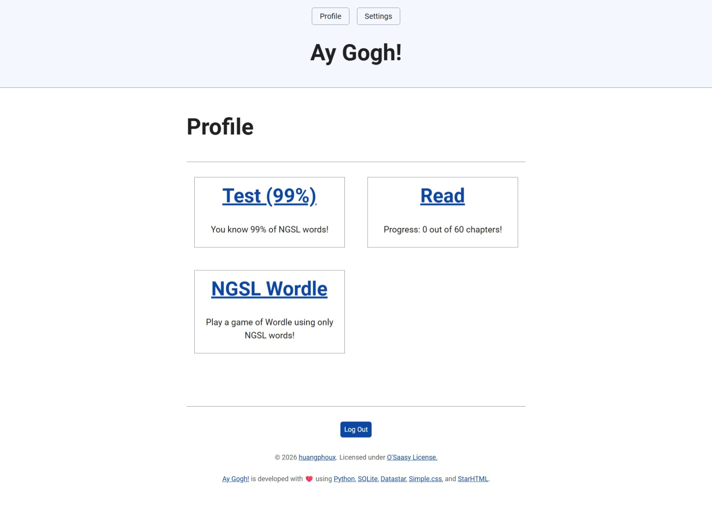

# Ay Gogh!

This repository contains a website dedicated to bring the book [English by the Nature Method](https://archive.org/details/english-by-the-nature-method/) (1942) by Authur Jensen to the modern age, built using [StarHTML](https://starhtml.com/), [Datastar](https://data-star.dev/), and [SQLite](https://sqlite.org/). It demonstrates how to create a modern, reactive web application with server-side rendering and real-time updates.




## Name origin

英語 → 英(ei) 語(go) → Eigo → Ay Gogh!

## Features

- Test your core vocabulary with [NGSLT](https://www.newgeneralservicelist.com/ngslt-nawlt)
- Gauge the reading ease of each chapter to your ability
- Incremental reading by focus on each sentence one-at-a-time
- Select a word to check its meanings, part of speech, synonyms, antonyms, and its [NGSL](https://www.newgeneralservicelist.com/new-general-service-list) level
- Collect your favorite words then review them later with [FSRS](https://github.com/open-spaced-repetition/free-spaced-repetition-scheduler)
- Optimize the [algorithm](https://github.com/open-spaced-repetition/awesome-fsrs/wiki/ABC-of-FSRS) to match your style of learning
- Play a game of Wordle using only NGSL words

## Technical details
- [HATEOAS](https://htmx.org/essays/hateoas/) with StarHTML
- [HOWL](https://htmx.org/essays/hypermedia-on-whatever-youd-like/) with Python
- Server-driven interactive UI with Datastar
- Single Tenant databases with SQLite

## Prerequisites

- [uv](https://docs.astral.sh/uv/)

## Getting Started

1. Clone the repository:

```sh
git clone cd ay_gogh
```

2. Install dependencies:

```sh
uv sync
```

3. Set up environment variables:
   Copy the `.env.example` file in the root directory and modify each of them to your heart desired.

4. Run the development server:

```sh
uv run main.py
```

6. Open your browser and navigate to `http://localhost:1984` to see the application running.

## Technologies Used

- [StarHTML](https://starhtml.com/): server-side Python hypermedia framework
- [Datastar](https://data-star.dev/): client-side JavaScript hypermedia framework
- [SQLite](https://www.sqlite.org/): Embedded database
- [Simple.css](https://simplecss.org/): Classless CSS framework
